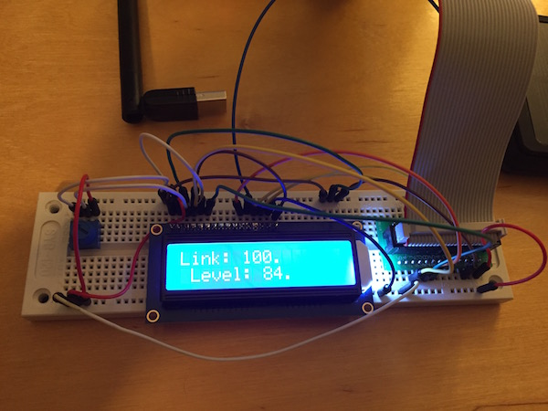
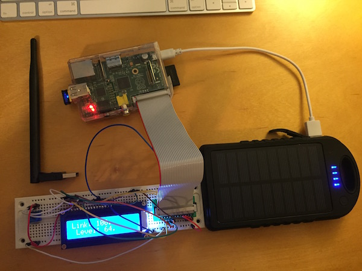

# wifimon
Portable Wifi Monitor in Swift on Raspberry Pi

Code for my [blog post](http://saygoodnight.com/2016/04/05/portable-wifimon-raspberrypi.html)

Realized I should have probably gave instructions for wget of [SwiftyGPIO](https://github.com/uraimo/SwiftyGPIO) and [HD44780](https://github.com/uraimo/HD44780CharacterLCD.swift), rather than embedding here.  So just know these might be out of date.

